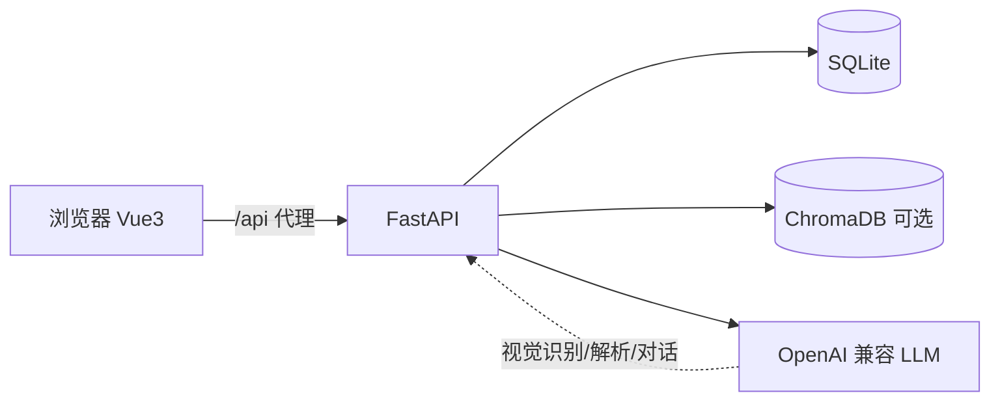

# Recall AI · 开发文档

> **文档定位**：本文面向开发者，描述系统架构、接口契约、数据模型与扩展方式。
> 产品背景与需求见 [`docs/PRD.md`](./PRD.md)；安装与使用见 [`README.md`](../README.md)。
> 设计系统（极简蓝调）见仓库根 `design-system/index.html`（高保真原型见 `prototype/index.html`）。

---

## 1. 架构总览

Recall 是**前后端分离**的本地优先（local-first）应用，仓库为 monorepo：

```
浏览器 (Vue SPA)
   │  /api  （Vite dev 代理，生产可交由静态托管 + 反向代理）
   ▼
FastAPI 后端 (uvicorn :8000)
   ├── SQLite       本地错题/分类/对话/配置（主存储）
   ├── ChromaDB     错题向量库（语义检索，可选增强）
   └── OpenAI 兼容 LLM  （DeepSeek / SiliconFlow / Qwen-VL 等，AI 能力）
```



- **数据流**：前端通过 `@/api` 调 `/api/*` → FastAPI 路由 → SQLite 读写 / ChromaDB 检索 / LLM 调用 → JSON 返回。
- **本地优先**：所有用户数据落在 `backend/data/`（SQLite + ChromaDB），**不强制上云**；AI 仅通过标准 OpenAI 兼容接口接入。
- **降级策略**：OCR 与向量检索均设计为「增强能力」——依赖缺失时静默降级，不影响核心 CRUD。

---

## 2. 技术栈

| 层 | 技术 | 说明 |
|---|---|---|
| 前端 | Vue 3 + TypeScript + Vite | 组合式 API，无独立状态库（组件级 `ref`） |
| 前端样式 | Tailwind CSS | 设计 token 见 `design-system/index.html` |
| 公式渲染 | KaTeX（`MathText.vue`） | 支持 `$…$`、`$$…$$`、`\(…\)`、`\[…\]` 四种定界符 |
| 后端 | FastAPI + Pydantic v2 | 异步入口 + 标准库 `sqlite3`（零额外 DB 依赖） |
| 向量库 | ChromaDB（可选） | 语义检索，未安装则跳过 |
| AI | OpenAI 官方 SDK（兼容接口） | `chat` / `solve` / `vision_ocr` |
| 导出 | ReportLab | 错题集 PDF（含中文字体注册） |
| 存储 | SQLite + ChromaDB 持久化 | 本地文件，路径可配 |

---

## 3. 目录结构

```
recall/
├── backend/
│   ├── app/
│   │   ├── main.py            # 入口：FastAPI 实例、CORS、lifespan、/api/health
│   │   ├── config.py          # pydantic-settings，读取 .env
│   │   ├── database.py        # sqlite3 连接、建表、迁移、种子数据
│   │   ├── schemas.py         # Pydantic 请求/响应模型
│   │   ├── llm_client.py      # LLM 封装：chat / solve_question / vision_ocr
│   │   ├── ocr_client.py      # PaddleOCR-VL 降级封装
│   │   ├── chroma_client.py   # 向量库封装（语义检索）
│   │   ├── pdf_export.py      # ReportLab PDF 导出 + 中文字体
│   │   └── routers/           # mistakes / chat / dashboard / settings / upload / help
│   ├── requirements.txt
│   ├── .env.example
│   └── data/                  # 运行时生成（已 gitignore，不入库）
├── frontend/
│   ├── src/
│   │   ├── api/index.ts       # axios 封装，按模块导出 mistakesApi/chatApi/...
│   │   ├── types/index.ts     # 与后端 schemas 对应的 TS 类型
│   │   ├── router/index.ts    # 5 条路由
│   │   ├── views/             # Home / Chat / Dashboard / Settings / Help
│   │   └── components/        # MathText / MistakeCard / BaseModal / AppSidebar ...
│   ├── vite.config.ts         # /api 代理到 :8000
│   └── package.json
├── docs/                      # PRD.md / DEVELOPMENT.md
├── design-system/             # 设计系统参考页
├── prototype/                 # 高保真原型页
├── README.md
└── LICENSE
```

---

## 4. 后端详解

### 4.1 启动与生命周期

- 入口 `app/main.py`：`FastAPI(title="Recall AI", version="1.0.0")`。
- `lifespan` 在启动时执行 `init_db()`（建表 + 迁移）与 `seed_if_empty()`（首次写入默认分类与设置）。
- CORS 当前为 `allow_origins=["*"]`（开发便利），**生产环境应收紧为前端域名**。
- `GET /api/health` → `{"status":"ok","product":"Recall AI"}`。

### 4.2 配置（`.env` / `config.py`）

通过 `pydantic-settings` 从 `backend/.env` 读取：

| 变量 | 默认 | 说明 |
|---|---|---|
| `DEEPSEEK_API_KEY` | 空 | 大模型 Key（任意 OpenAI 兼容服务均可） |
| `DEEPSEEK_MODEL` | `deepseek-chat` | 对话/解析模型；如 `deepseek-ai/DeepSeek-V3.2` |
| `DEEPSEEK_BASE_URL` | `https://api.deepseek.com` | 服务地址（SiliconFlow 填 `https://api.siliconflow.cn/v1`） |
| `SQLITE_PATH` | `./data/recall.db` | SQLite 路径 |
| `CHROMA_PATH` | `./data/chroma` | ChromaDB 路径 |
| `PORT` | `8000` | 监听端口 |

> 视觉识别模型 `VISION_MODEL` 在 `llm_client.py` 中硬编码为 `Qwen/Qwen3-VL-8B-Instruct`，与 `DEEPSEEK_MODEL` 解耦。

### 4.3 数据模型（`database.py`）

五张表：

| 表 | 关键字段 | 说明 |
|---|---|---|
| `categories` | `id, name, color` | color 为 1–8，对应设计系统「错题本 8 色」 |
| `mistakes` | `id, category_id(FK), question, answer, source, subject, knowledge_point, review_count, mastery, snooze_until, created_at, updated_at` | 核心实体；`mastery` ∈ `unmastered/reviewing/mastered` |
| `chat_sessions` | `id, title, created_at, updated_at` | 对话会话 |
| `chat_messages` | `id, session_id(FK), role, content, created_at` | 对话消息，`ON DELETE CASCADE` |
| `settings` | `id(固定=1), model_name, api_key, base_url` | 单例配置行 |

- **种子数据**：首次启动写入默认分类（数学/英语/物理/化学/其他，各一种颜色）与默认设置行。
- **迁移**：`_migrate()` 对已有 `mistakes` 表追加 `snooze_until` 列（不破坏历史数据）。

### 4.4 API 端点清单

所有业务接口前缀 `/api`。下列 `MistakeOut` 等响应结构见 `schemas.py` / `types/index.ts`。

**错题与分类** `prefix=/api/mistakes`

| 方法 | 路径 | 说明 | 请求体 / 参数 | 响应 |
|---|---|---|---|---|
| GET | `/categories` | 分类列表（含各分类错题数） | — | `CategoryOut[]` |
| POST | `/categories` | 新建分类 | `CategoryCreate` | `CategoryOut` 201 |
| PUT | `/categories/{cid}` | 改分类名/色 | `CategoryCreate` | `CategoryOut` |
| DELETE | `/categories/{cid}` | 删除分类 | — | 204 |
| GET | `` | 错题列表（可筛选） | `?category_id&subject&status&q` | `MistakeOut[]` |
| POST | `` | 新建错题（同步写向量库） | `MistakeCreate` | `MistakeOut` 201 |
| GET | `/export` | 导出 PDF | `?ids=1,2,3`（缺省全部） | `application/pdf` |
| GET | `/{mid}` | 错题详情 | — | `MistakeOut` |
| PUT | `/{mid}` | 更新错题 | `MistakeUpdate` | `MistakeOut` |
| DELETE | `/{mid}` | 删除错题（同步删向量） | — | 204 |
| POST | `/{mid}/review` | 记一次复习 | — | `MistakeOut` |
| POST | `/{mid}/snooze` | 暂缓复习（默认随机 5–7 天） | `{days?}` | `MistakeOut` |
| POST | `/semantic` | 语义检索相似错题 | `{q, n=5}` | `MistakeOut[]` |

**AI 对话** `prefix=/api/chat`

| 方法 | 路径 | 说明 | 响应 |
|---|---|---|---|
| GET | `/sessions` | 会话列表 | `ChatSessionOut[]` |
| POST | `/sessions` | 新建会话（`?title`） | `ChatSessionOut` 201 |
| GET | `/sessions/{sid}/messages` | 消息列表 | `ChatMessageOut[]` |
| POST | `/sessions/{sid}/messages` | 发消息（带历史上下文） | `ChatMessageOut[]` |
| DELETE | `/sessions/{sid}` | 删会话 | 204 |
| POST | `/solve` | 根据题目生成 AI 解析 | `{answer, available}` |

**看板 / 设置 / 上传 / 帮助**

| 方法 | 路径 | 说明 | 响应 |
|---|---|---|---|
| GET | `/api/dashboard/stats` | 统计（总数/复习/成功率/趋势/学科分布） | `DashboardStats` |
| GET | `/api/settings` | 读取设置（`api_key` 返回 `********` 掩码） | `SettingsOut` |
| PUT | `/api/settings` | 保存设置（含掩码则保留原 Key） | `SettingsOut` |
| POST | `/api/upload/ocr` | 上传图片 OCR（`multipart file`） | `{available, text, message}` |
| GET | `/api/help` | 帮助中心静态文档 | `HelpDoc` |

### 4.5 关键模块设计

- **`llm_client.py`（AI 封装）**
  - `chat(messages)`：通用对话，`SYSTEM_PROMPT` 约束为「分步骤、鼓励式」辅导风格，`temperature=0.7`。
  - `solve_question(question)`：固定格式解析（【思路】【解答】【答案】【易错提醒】），`max_tokens=1536`（避免长公式截断），`temperature=0.4`；**强制要求公式只用 `$…$` / `$$…$$`**，禁止 `\(…\)` / `\[…\]`。
  - `vision_ocr(image_path)`：多模态识别（base64 data-url），`VISION_MODEL=Qwen/Qwen3-VL-8B-Instruct`，`max_tokens=1024`。
  - `is_configured()`：`bool(api_key)`，未配置时对话/solve 返回友好占位而非报错。
- **OCR 三级降级**（`routers/upload.py`）：① 已配 AI → 视觉识别；② 视觉识别异常 且本地 `PaddleOCR-VL` 可用 → 降级；③ 均无 → 返回「未配置」提示。`_clean_ocr()` 过滤安装提示类噪声。
- **`chroma_client.py`（向量库）**：`upsert/delete/query_similar`，全部 `try/except` 静默跳过——**向量库不可用绝不影响错题 CRUD**。
- **`pdf_export.py`（PDF）**：ReportLab 生成；`_register_chinese_font()` 按优先级回退（项目自带 Noto → 系统微软雅黑/黑体 → Linux 字体）。**注意：PDF 为纯文本导出，不渲染 LaTeX 公式（`$…$` 以原文呈现）。**
- **设置掩码**（`routers/settings.py`）：`GET` 返回 `********`；`PUT` 时若 `api_key` 含掩码则保留原值，空串则清空。保存后**同步到运行期 `settings`**，无需重启即生效。
- **对话上下文过滤**（`routers/chat.py`）：以中文全角括号 `（` 开头的 assistant 回复（降级/失败占位）不进入后续上下文，避免失败文本污染导致持续异常。

---

## 5. 前端详解

### 5.1 路由（`router/index.ts`）

| 路径 | 视图 | 标题 |
|---|---|---|
| `/` | `HomeView` | 错题集 |
| `/chat` | `ChatView` | AI 答疑 |
| `/dashboard` | `DashboardView` | 数据看板 |
| `/settings` | `SettingsView` | 模型设置 |
| `/help` | `HelpView` | 帮助中心 |

全部懒加载（`() => import(...)`）。

### 5.2 API 封装（`src/api/index.ts`）

- `axios` 实例：`baseURL: '/api'`，默认 `timeout: 60000`。
- 按域导出：`mistakesApi` / `categoriesApi` / `chatApi` / `dashboardApi` / `settingsApi` / `uploadApi` / `helpApi`。
- **超时放宽**：`chatApi.solve` → `180000`（解析推理慢）；`uploadApi.ocr` → `120000`（视觉识别冷启动慢）。
- `mistakesApi.exportPdf()` 将 Blob 触发浏览器下载（`recall-mistakes-YYYY-MM-DD.pdf`）。

### 5.3 类型（`src/types/index.ts`）

与后端 `schemas.py` 一一对应：`Category` / `Mistake` / `ChatSession` / `ChatMessage` / `Settings` / `DashboardStats` / `HelpDoc`；`Mastery = 'unmastered' | 'reviewing' | 'mastered'`。

### 5.4 视图与组件

**视图（5）**：`HomeView`（列表 + OCR 弹窗 + 「AI 解析并填入 / 仅填题干」双选 + 筛选搜索）、`ChatView`、`DashboardView`、`SettingsView`、`HelpView`。

**组件（13）**：

| 组件 | 用途 |
|---|---|
| `MathText.vue` | **KaTeX 渲染**：正则匹配 4 种定界符；公式 `.trim()`；块级 `overflow-x:auto`；渲染失败 fallback 灰色源码 |
| `MistakeCard.vue` | 错题卡片（题目/解析经 MathText，知识点标签、复习按钮） |
| `BaseModal.vue` | 通用模态（OCR 弹窗、录入弹窗复用） |
| `BaseButton.vue` / `BaseInput.vue` / `BaseTag.vue` | 设计系统基础控件 |
| `AppSidebar.vue` / `CategoryNav.vue` | 侧边导航 / 分类导航 |
| `BarChart.vue` / `StatCard.vue` | 看板图表与指标卡 |
| `ChatMessage.vue` | 对话气泡（内容经 MathText） |
| `Icon.vue` / `EmptyState.vue` | 图标 / 空状态 |

**设计系统**：极简蓝调（`#007AFF` 主色、`#F5F5F7` 页面、`#E5E5EA` 边框、无阴影、8px 栅格、错题本 8 色标签）。完整 token 与可视化见 `design-system/index.html`。

**状态管理**：当前**无独立 store/composables 层**——页面在组件内用 `ref` 维护状态，通过 `@/api` 直接调后端，必要时用 props/events 或 `localStorage` 共享。如需规模化，建议后续引入 Pinia。

### 5.5 开发约定

- 前端类型以 `types/index.ts` 为单一事实来源，新增接口同步更新类型与 `api/index.ts`。
- 公式内容统一使用 `$…$` / `$$…$$`，前端 `MathText` 与后端 `SOLVE_PROMPT` 双端约束一致。

---

## 6. 本地开发

### 6.1 后端

```bash
cd backend
python -m venv .venv
.venv\Scripts\activate          # Windows；macOS/Linux: source .venv/bin/activate
pip install -r requirements.txt
cp .env.example .env            # 填入 DEEPSEEK_API_KEY 等
python -m uvicorn app.main:app --host 0.0.0.0 --port 8000
```

### 6.2 前端

```bash
cd frontend
npm install
npm run dev                     # http://localhost:5173
npm run build                   # 产物 dist/（已 gitignore）
npm run typecheck               # vue-tsc 类型检查，要求零错误
```

> **依赖安装注意**：若使用 WorkBuddy 托管的 Node，安装前需先 `unset CODEBUDDY_SESSION_ID CLAUDE_SESSION_ID`，否则 `npm` 会被 safe-delete shim 拦截导致依赖残缺。`vite.config.ts` 使用了 `node:url`，已通过 `@types/node`（devDependency）保证 `vue-tsc` 构建通过。

---

## 7. 扩展指南

### 7.1 新增后端接口
1. 在 `app/routers/` 新建或扩展一个 router 文件（用 `APIRouter(prefix=...)`）。
2. 在 `app/schemas.py` 定义请求/响应模型。
3. 在 `app/main.py` 已统一 `include_router`（六个 router），新增文件后补一行 `include_router`。
4. 涉及新实体时，在 `database.py` 的 `init_db()` 建表，必要时在 `_migrate()` 处理存量列。

### 7.2 新增前端页面
1. 在 `src/views/` 新建 `XxxView.vue`。
2. 在 `src/router/index.ts` 注册路由。
3. 在 `src/api/index.ts` 增加对应 api 方法（如需）。
4. 复用 `BaseModal/BaseButton/BaseInput/BaseTag` 等基础控件保持设计统一。

### 7.3 接入新的大模型
LLM 走 OpenAI 兼容协议：改 `backend/.env` 的 `DEEPSEEK_BASE_URL` / `DEEPSEEK_MODEL` / `DEEPSEEK_API_KEY` 即可，无需改代码（视觉识别模型 `VISION_MODEL` 在 `llm_client.py` 硬编码，换视觉模型时需改该常量）。

---

## 8. 测试与质量

- **后端**：`python -m py_compile app/*.py app/routers/*.py` 做语法门禁；建议后续补充 `pytest`（接口层与 `llm_client` 降级分支）。
- **前端**：`npm run typecheck`（`vue-tsc` 零错误）+ `npm run build` 为交付门禁。
- **端到端**：浏览器走 `5173` 代理访问 `8000`，或前端 `dist/` 交由任意静态服务 + 反向代理 `/api`。

---

## 9. 故障排查

| 现象 | 排查 |
|---|---|
| 前端列表/设置空白 | **先确认后端 `:8000` 是否存活**（最常见误判为「数据丢失」）。`curl http://localhost:8000/api/health` |
| OCR 失败 | 检查 `DEEPSEEK_API_KEY` 是否配置（优先走视觉识别）；或本地是否 `pip install paddlepaddle paddleocr`（降级） |
| AI 解析超时 | 前端 `solve` 超时已放宽至 180s；后端 `max_tokens=1536` 控制长度，过慢可下调 |
| 公式显示为源码 | 确认使用 `$…$` / `$$…$$`；`\(…\)` / `\[…\]` 不被 `MathText` 渲染 |
| PDF 中文乱码/方块 | 见 `pdf_export._register_chinese_font()` 字体候选；部署环境建议把 `NotoSansCJKsc-Regular.otf` 放到 `app/assets/fonts/` |
| 依赖安装残缺 | 见 6.2「依赖安装注意」（WorkBuddy 托管 Node 的 safe-delete 拦截） |

---

## 10. 安全与隐私

- `backend/.env`（含 API Key）、`backend/data/`（用户错题与向量库）均已 **gitignore，禁止入库**。
- `settings.api_key` 在 `GET` 时以 `********` 掩码返回，前端回填时识别掩码保留原值。
- CORS 当前为 `*`，**生产部署必须收紧**。
- 所有用户数据默认本地存储，未做任何外部上传（AI 仅发送题目文本/图片至所配置的模型服务）。
