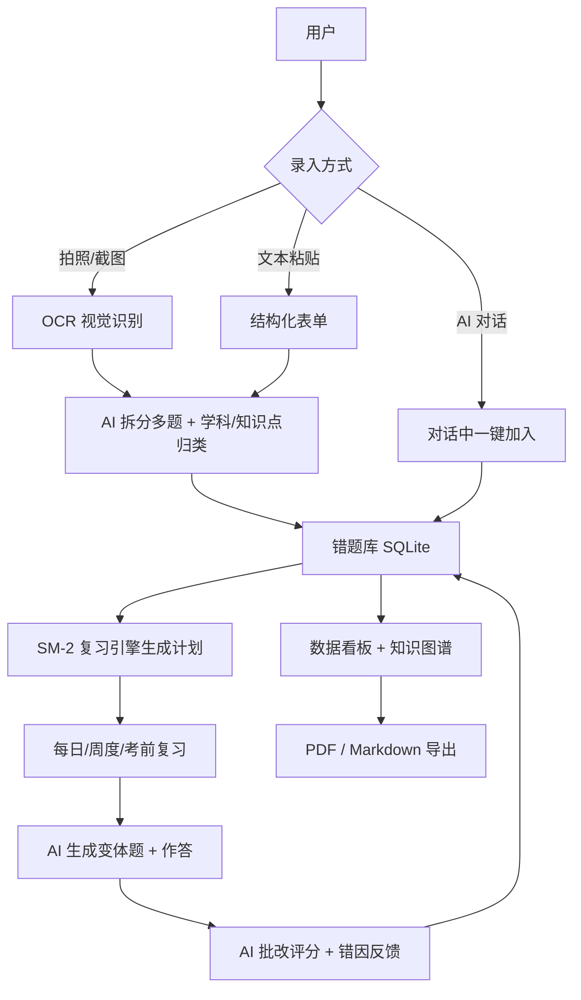
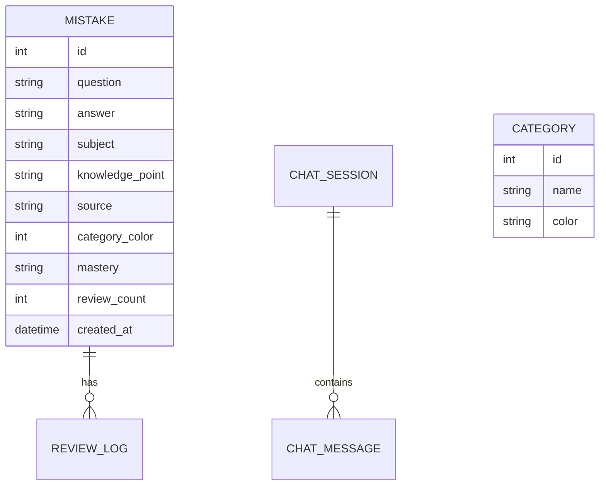
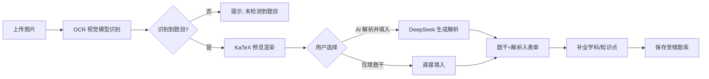
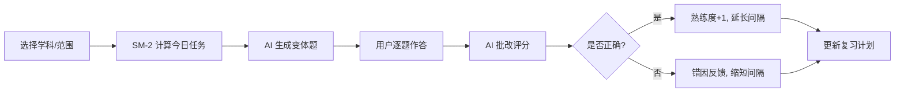
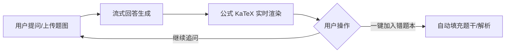

# Recall AI 智能错题本 · 产品需求文档（PRD）

> 版本：v1.0 ｜ 状态：MVP 开发进行中 ｜ 最后更新：2026-08-20
> 文档角色：AI 产品经理 ｜ 评审对象：研发 / 设计 / 测试

---

## 1. 产品背景与目标

### 1.1 背景
学生日常积累错题时普遍面临三类痛点：
- **录入慢**：手动抄写题干、答案、错因，耗时且易遗漏；
- **不会复习**：错题做完即忘，缺乏科学的间隔重复计划；
- **讲不清**：遇到不懂的题只能查零散资料，缺少针对自身错因的讲解与变式训练。

Recall 定位为 **AI 驱动的智能错题管理平台**：通过拍照/截图/OCR 自动识别题目，借助大模型完成学科归类、知识点拆解、错因总结与解析生成；基于记忆算法自动排布复习计划，并通过 AI 变体题与对话式答疑形成"录入—复习—答疑"闭环。

### 1.2 产品目标
| 目标类型 | 描述 | 衡量指标 |
|---|---|---|
| 核心目标 | 把"错题从录入到掌握"的全流程压缩到最低手动操作 | 单条错题平均录入耗时 < 30s |
| 体验目标 | 识别准确率与解析可读性达到可直接使用 | OCR 识别准确率 ≥ 95%，公式渲染成功率 ≥ 99% |
| 留存目标 | 通过复习计划与数据看板建立使用习惯 | 周活跃率 ≥ 40%，复习完成率 ≥ 60% |
| 技术目标 | 本地优先、隐私可控、响应及时 | 见非功能需求章节 |

### 1.3 产品原则
- **本地优先**：数据默认存本地 SQLite，不上传即可使用；
- **AI 可选**：识别/解析/对话均依赖用户自配模型 Key，未配置时核心录入不阻断；
- **可读优先**：所有公式用 KaTeX 渲染，解析结构固定（思路/解答/答案/易错提醒）。

---

## 2. 目标用户画像

### 2.1 核心用户
- **中学生 / 高中生（主）**：数理化科目错题多、需应对中高考复习；
- **大学生 / 考研党**：高数、线代、专业课公式密集，需要变体训练；
- **自习型成人**：考证、进修中自主整理错题。

### 2.2 用户画像卡
| 维度 | 画像 A：高三理科生 | 画像 B：考研数学党 |
|---|---|---|
| 年龄 | 17-18 岁 | 21-24 岁 |
| 核心诉求 | 快速扫题入库、考前针对性复习 | 公式题精准识别、变体题强化 |
| 使用场景 | 晚自习拍卷子、周末复习 | 刷题后批量录入、每日定量复习 |
| 痛点 | 手写录入太慢 | LaTeX 公式错乱、讲解看不懂 |
| 关键功能 | 图片识别、一键复习、看板 | OCR 公式渲染、AI 对话答疑 |

### 2.3 使用环境
- 终端：桌面浏览器为主（Windows / macOS），移动端 H5 为辅；
- 网络：校园网 / 家庭宽带，模型 API 走云端；
- 设备：手机拍照、平板截图、电脑粘贴文本。

---

## 3. 业务核心逻辑（Mermaid 流程图）

### 3.1 总体业务闭环

### 3.2 数据模型关系

---

## 4. 功能流程描述（Mermaid 流程图）

### 4.1 识图录入流程

### 4.2 一键复习流程

### 4.3 AI 对话流程

---

## 5. 功能需求详情

### 5.1 错题录入（MVP · 已实现）
| 编号 | 功能 | 描述 | 优先级 |
|---|---|---|---|
| FR-1.1 | 图片识别录入 | 上传截图/照片 → Qwen3-VL 视觉识别 → KaTeX 预览 → 选择「AI 解析并填入」或「仅填题干」 | P0 |
| FR-1.2 | 文本录入 | 手动粘贴题干/解析，支持 `$...$` `$$...$$` `\(...\)` `\[...\]` 四种 LaTeX 定界符实时渲染预览 | P0 |
| FR-1.3 | AI 解析生成 | 调用 DeepSeek 按固定格式（思路/解答/答案/易错提醒）生成解析，超时 180s，失败保留仅填题干 | P0 |
| FR-1.4 | 学科/知识点标注 | 录入表单支持学科、知识点标签、来源、分类色 | P1 |
| FR-1.5 | 多题拆分 | AI 将一张图里的多道题拆为独立条目，逐条勾选导入（规划中） | P1 |

### 5.2 错题本管理（MVP · 已实现）
| 编号 | 功能 | 描述 | 优先级 |
|---|---|---|---|
| FR-2.1 | 列表展示 | 卡片式错题流，题目区蓝条 / 解析区绿条，公式 KaTeX 渲染 | P0 |
| FR-2.2 | 搜索与筛选 | 按题目/解析/知识点全文搜索；按状态（未掌握/复习中/已掌握）筛选 | P0 |
| FR-2.3 | 编辑/删除 | 卡片内联编辑与删除，弹窗表单复用录入组件 | P0 |
| FR-2.4 | 分类管理 | 学科色分类，支持新增分类 | P1 |
| FR-2.5 | 多选批量操作 | 全选/取消、批量导出或删除（部分实现） | P2 |

### 5.3 一键复习（MVP · 已实现基础版）
| 编号 | 功能 | 描述 | 优先级 |
|---|---|---|---|
| FR-3.1 | 复习计划生成 | 基于 SM-2 算法，按错题熟练度生成每日/周度复习队列 | P0 |
| FR-3.2 | 逐题复习 | 复习弹窗展示题干→用户回忆→揭示解析，记录复习次数 | P0 |
| FR-3.3 | 变体题与批改 | AI 生成同类变体题，用户作答后 AI 批改评分（规划中强化） | P1 |

### 5.4 AI 对话（MVP · 已实现）
| 编号 | 功能 | 描述 | 优先级 |
|---|---|---|---|
| FR-4.1 | 流式答疑 | 对话页提问，DeepSeek 流式返回，首字 < 2s | P0 |
| FR-4.2 | 公式渲染 | 对话气泡内公式 KaTeX 渲染 | P0 |
| FR-4.3 | 一键入错 | 对话中可将题目/解析一键加入错题本 | P1 |
| FR-4.4 | 多会话管理 | 新建/切换/删除对话会话 | P2 |

### 5.5 数据看板（MVP · 页面已建）
| 编号 | 功能 | 描述 | 优先级 |
|---|---|---|---|
| FR-5.1 | 学习趋势 | 按时间展示录入量、复习完成率 | P1 |
| FR-5.2 | 知识图谱 | 按学科/知识点聚合错题分布 | P1 |
| FR-5.3 | 薄弱点提示 | 基于错题率推荐重点复习模块 | P2 |

### 5.6 导出与设置（MVP · 已实现）
| 编号 | 功能 | 描述 | 优先级 |
|---|---|---|---|
| FR-6.1 | PDF / Markdown 导出 | 单条或批量导出错题集 | P1 |
| FR-6.2 | 模型设置 | 配置 DeepSeek / 视觉模型 Key 与 base_url，未配置时降级提示 | P0 |
| FR-6.3 | 帮助中心 | 使用引导、LaTeX 语法说明、常见问题 | P2 |

---

## 6. 非功能需求

| 类别 | 需求 | 指标 |
|---|---|---|
| 性能 | API 常规响应 | < 500ms（非 AI 生成类） |
| 性能 | AI 流式首字延迟 | < 2s |
| 性能 | OCR 识别耗时 | < 10s（单图） |
| 性能 | 首屏加载 | < 2s |
| 容量 | 错题存储 | 支持 10,000+ 条本地存储无性能瓶颈 |
| 存储 | 数据归属 | 默认本地 SQLite，隐私优先 |
| 兼容 | 浏览器 | Chrome / Edge / Safari 最新版 |
| 兼容 | 响应式 | 桌面双列、移动端单列自适应 |
| 健壮 | 容错 | AI 不可用时不阻断核心录入；公式渲染失败显示源码而非报错 |
| 安全 | Key 管理 | 模型 Key 仅存本地，不明文上传 |

---

## 7. 验收标准

### 7.1 录入链路验收
- [ ] 上传含公式的试卷截图，10s 内返回识别结果，公式以渲染形式预览；
- [ ] 点击「AI 解析并填入」后，录入弹窗题干+解析均正确填充，公式可读；
- [ ] 仅填题干路径不触发 AI 调用，秒级完成；
- [ ] 未配置模型 Key 时，识别/解析按钮明确提示而非静默失败。

### 7.2 复习链路验收
- [ ] 错题可加入当日复习队列，复习弹窗正确展示题干与解析；
- [ ] 复习后熟练度/间隔按 SM-2 更新，看板趋势同步。

### 7.3 渲染验收
- [ ] 题目/解析/对话中 `$...$`、`$$...$$`、`\(...\)`、`\[...\]` 均正确渲染；
- [ ] 超宽块级公式可横向滚动，不被截断；
- [ ] 渲染失败时降级显示灰色源码，无红色报错打断阅读。

### 7.4 性能验收
- [ ] 首屏 < 2s；OCR < 10s；AI 流式首字 < 2s；常规 API < 500ms；
- [ ] 10,000 条数据下列表滚动与搜索流畅。

---

## 8. 技术方案概要

### 8.1 技术栈
| 层 | 技术选型 |
|---|---|
| 前端 | Vue 3 + TypeScript + Vite + Vue Router + KaTeX |
| 后端 | FastAPI（Python）+ Uvicorn |
| 数据库 | SQLite（业务数据，node:sqlite / better-sqlite3） |
| 向量库 | ChromaDB（知识点检索 / 语义去重，规划） |
| 视觉模型 | Qwen3-VL-8B-Instruct（SiliconFlow 视觉 OCR） |
| 语言模型 | DeepSeek / DeepSeek-Chat（解析、对话、变体题） |
| 导出 | PDF（如 markdown-pdf / 浏览器打印）、Markdown |

### 8.2 关键接口
| 接口 | 方法 | 说明 |
|---|---|---|
| `/api/upload/ocr` | POST | 图片上传 → 视觉模型识别 → 返回题目文本 |
| `/api/chat/solve` | POST | 题干 → AI 解析（思路/解答/答案/易错提醒） |
| `/api/mistakes` | CRUD | 错题增删改查 |
| `/api/chat/sessions` | CRUD | 对话会话管理 |
| `/api/review/plan` | GET | 基于 SM-2 生成复习计划 |

### 8.3 前端架构要点
- **组件化**：`HomeView`（列表+录入+OCR+复习）、`ChatView`、`DashboardView`、`SettingsView`、`HelpView`；
- **公式渲染**：`MathText.vue` 统一解析四种 LaTeX 定界符，KaTeX `displayMode` 区分行内/块级；
- **状态管理**：路由 query 触发新建（`?new=`），组合式 API + `ref`/`computed`；
- **样式系统**：极简蓝调 Design System（`design-system/index.html`），8px 栅格、细边框分层。

### 8.4 风险与对策
| 风险 | 对策 |
|---|---|
| 视觉模型对复杂公式识别偏差 | OCR 结果可编辑 + KaTeX 实时预览，用户修正后入库 |
| 长解析推理超时 | 限制 `max_tokens` + 前端 180s 超时 + 失败降级 |
| 本地存储容量 | SQLite + 索引优化，图片转缩略图存储 |
| 模型 Key 安全 | 仅本地保存，后端代理调用不落库 |

---

> 附录：本文档功能状态标注——**"已实现"** 指当前前端页面已可操作；**"规划中"** 指已预留入口/数据结构，待迭代完善。
